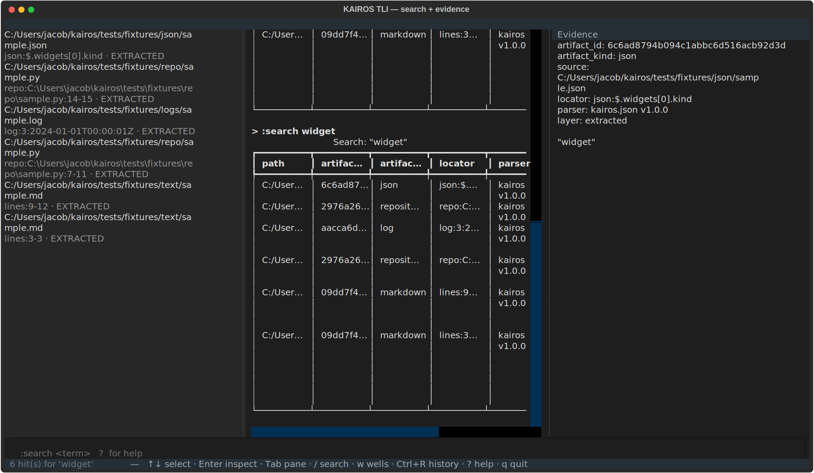

<div align="center">

# KAIROS

**Your corpus. Your machine. Receipts for every claim.**

A local-first, terminal-native workspace that traces the lineage of a
personal technical corpus — no cloud, no telemetry, no LLM required, and
no result it can't point to an exact byte of evidence for.

[](https://github.com/Jacobcdsmith/kairos/actions/workflows/ci.yml)
[](LICENSE)
[](pyproject.toml)
[](pyproject.toml)
[](https://github.com/astral-sh/ruff)
[](docs/architecture.md)
[](docs/tli.md)

[Quick start](#quick-start) ·
[Why KAIROS](#why-kairos) ·
[CLI reference](docs/cli.md) ·
[Terminal Lineage Interface](docs/tli.md) ·
[Architecture](docs/architecture.md) ·
[Status](docs/v0.1-status.md) ·
[Contributing](CONTRIBUTING.md)

</div>

---

<div align="center">


<sub>`kairos tui` — an actual screenshot, not a mockup. Every field on
screen is a real column from a real SQLite row.</sub>
</div>

---

Most "AI knowledge base" tools ask you to trust a vector index and hope the
nearest neighbor was the right one. KAIROS doesn't do vibes. It parses your
docs, code, configs, and logs by their actual structure — headings, AST
nodes, JSON paths, Kconfig symbols, log lines — and links them with
explicit, typed, re-derivable relations. Ask it for something and it hands
you the exact artifact, the exact locator, and the exact rule that put it
there. No embedding ever gets a vote.

It is **not** a chatbot and **not** a generic RAG wrapper. It's a
source-grounded local workspace: ingest documents, repositories, structured
configuration, logs, and notes; trace concepts and implementation artifacts
through those sources via exact, explicit relations (no embeddings, no
similarity guessing); form curated working sets called **coherence wells**;
and inspect the exact evidence — down to the line, page, JSON path, or
Kconfig symbol — behind every result KAIROS gives you. Drive it from a
scriptable CLI or from `kairos tui`, a full-screen terminal workspace built
for staying in one place all day.

This is the **v0.1 substrate + v0.2-alpha interface**. Both are fully
usable without any LLM, require no network access, and store everything
locally in SQLite.

## Why KAIROS

| | |
|---|---|
| **Local-first, always** | No cloud dependency, no telemetry, no optional-but-really-mandatory network call. Every read and write stays on your machine, full stop. |
| **Corpus-native parsing** | Markdown, PDF, JSON, Kconfig-menu JSON, runtime/emulator logs, and Python repositories are each parsed by structure — headings, pages, JSON paths, symbols, sessions, AST nodes — not blindly chunked by byte count. |
| **Provenance over vibes** | Every search hit, trace node, and shown span carries its artifact id, workspace-relative path, exact locator, parser version, and provenance layer (raw / extracted / derived / user). Nothing is allowed to masquerade as source truth. |
| **Read-only toward your sources** | KAIROS ingests bytes into a content-addressed, write-once store and never reopens the original file for writing. The only writes it ever makes to *your* data are additive: notes and well membership. |
| **Cross-document traversal without embeddings** | `kairos trace` walks explicit, typed relations (`heading_contains`, `imports`, `depends_on`, `log_in_session`, ...) built from cross-artifact entity reconciliation — so a bare word in one file's paragraph can reach a sibling document through a shared heading, two hops later, deterministically. |
| **A real exit code** | Every one of the twelve commands fails loudly and non-zero with an actionable message — never a silent no-op, never a bare traceback. |

## Quick start

### Prerequisites

- Python 3.12 or newer
- Nothing else. No database server, no API key, no Docker, no network access required at any point.

### 1. Install

```bash
git clone https://github.com/Jacobcdsmith/kairos.git
cd kairos

python -m venv .venv
# Windows:
.venv\Scripts\activate
# macOS/Linux:
source .venv/bin/activate

pip install -e ".[dev]"
```

### 2. Drive it from the CLI

```bash
# Create a workspace
kairos init ./my-workspace
cd my-workspace

# Ingest a file (markdown, text, PDF, JSON, Kconfig-menu JSON, logs, or
# a directory of Python files with --recursive)
kairos ingest ../notes/architecture.md

# See what's there
kairos artifacts

# Full-text search over everything ingested
kairos search "widget"

# Show one artifact's full parsed structure, with exact locators
kairos show <artifact-id>

# Trace a term or entity through direct matches and explicit relations
kairos trace "Widgets" --depth 2

# Curate a working set
kairos well create widget-work --purpose "Everything about the widget system"
kairos well add widget-work <artifact-id>
kairos well show widget-work

# Annotate anything you've ingested
kairos note add <artifact-id> "revisit this after the v0.2 redesign"

# Kconfig symbol lookup, log search with context, environment health
kairos config CONFIG_WIFI
kairos logs "connection" --level ERROR --before 2 --after 2
kairos doctor
```

Run [`scripts/demo.sh`](scripts/demo.sh) for a scripted walkthrough of every
command against the synthetic fixtures in `tests/fixtures/`.

### 3. Or drive it from the terminal workspace

Prefer to stay in one place instead of one command at a time? Install the
optional [Terminal Lineage Interface](docs/tli.md) — same commands, typed
into a persistent `:command` line, with Explorer/Workspace/Evidence panes
that keep the last search, trace, or note visibly on screen while you work:

```bash
pip install -e ".[tui]"
kairos tui
```

Both surfaces call the exact same service layer underneath, so nothing
about the CLI's guarantees changes by using one over the other — the TUI is
strictly a nicer window onto it. See [docs/tli.md](docs/tli.md) for the
full command grammar, keybindings, and current alpha limitations.

## Release verification

Every claim on this page — offline operation, source immutability, complete
provenance, explicit relation discipline, FTS integrity — is backed by a
test that was actually run, plus a build that installs independently of
this repository checkout. See
[docs/v0.1-status.md#audit-verification](docs/v0.1-status.md#audit-verification)
for the exact commands and their actual, current results.

## The full command surface

`init` · `ingest` · `artifacts` · `show` · `search` · `trace` · `note add` /
`note list` · `well create` / `well add` / `well remove` / `well show` /
`well list` · `config` · `logs` · `doctor` · `tui`

See [docs/cli.md](docs/cli.md) for the complete reference with options and
example output for every command, and [docs/tli.md](docs/tli.md) for the
Terminal Lineage Interface's command grammar, keybindings, and provenance
legend.

## How it's built

- **Storage**: SQLite as the canonical store, nine tables used verbatim
  against the spec (`artifacts`, `source_spans`, `entities`, `mentions`,
  `relations`, `notes`, `coherence_wells`, `well_members`, `events`), plus an
  FTS5 virtual table with sync triggers for full-text search — no separate
  search service, no vector database.
- **Migrations**: a single hand-written Alembic migration, run
  programmatically by `kairos init`.
- **Layering**: `domain/` (pure Python, zero framework imports) →
  `infrastructure/` (SQLAlchemy, parsers, filesystem, git) → `services/`
  (application logic) → `cli/` (Typer + Rich) and `tui/` (Textual, optional)
  as two independent presentation surfaces over the same services. See
  [CONTRIBUTING.md](CONTRIBUTING.md#architecture-rules) for the enforced
  boundaries.
- **Quality gate**: Python 3.12+ strict typing end to end, Pydantic v2 at
  every process boundary, Ruff for format+lint, Pyright in strict mode, and
  a pytest suite covering every parser's well-formed *and* malformed path,
  full CLI integration coverage, and headless Pilot coverage of the TUI.

Full detail in [docs/architecture.md](docs/architecture.md), including the
provenance model, the parser registry, and the explicit non-goals for this
milestone.

## What v0.1 doesn't do (on purpose)

Hardware/embedded systems, device clients, simulations or virtual
companions, remote node management, external messaging integrations, cloud
services, multi-agent orchestration, autonomous background execution,
self-modification, and model inference or model-provider integration are
all explicitly out of scope for this milestone — not omissions, a boundary
the project is designed around. See
[docs/architecture.md#non-goals-v01](docs/architecture.md#non-goals-v01) and
[docs/v0.1-status.md](docs/v0.1-status.md) for the full picture of what's in,
what's out, and what a later milestone might still add within this same
local-framework scope.

## Contributing

Bug reports, feature ideas, and pull requests are welcome — see
[CONTRIBUTING.md](CONTRIBUTING.md) for the development setup, architecture
rules, and the scope boundary above (read that part first, it'll save you
some work). Please also review the [Code of Conduct](CODE_OF_CONDUCT.md).
Found a security issue? See [SECURITY.md](SECURITY.md) rather than filing a
public issue.

## License

[MIT](LICENSE) © Jacob Smith
