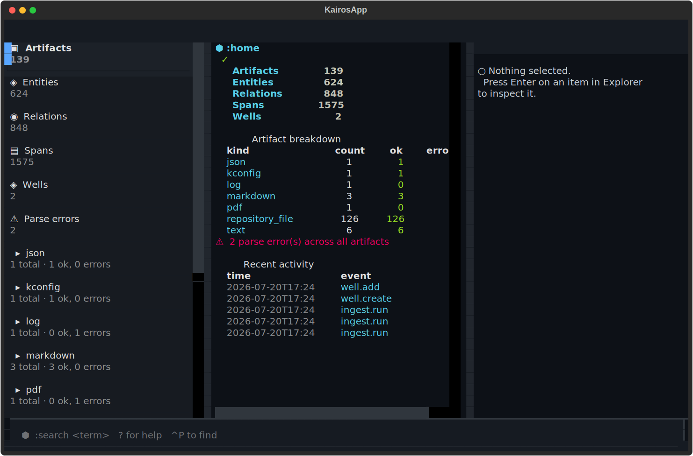

<div align="center">

```
╔══════════════════════════════════════════════════════════════╗
║                                                              ║
║     ██╗  ██╗ █████╗ ██╗██████╗  ██████╗ ███████╗            ║
║     ██║ ██╔╝██╔══██╗██║██╔══██╗██╔═══██╗██╔════╝            ║
║     █████╔╝ ███████║██║██████╔╝██║   ██║███████╗            ║
║     ██╔═██╗ ██╔══██║██║██╔══██╗██║   ██║╚════██║            ║
║     ██║  ██╗██║  ██║██║██║  ██║╚██████╔╝███████║            ║
║     ╚═╝  ╚═╝╚═╝  ╚═╝╚═╝╚═╝  ╚═╝ ╚═════╝ ╚══════╝            ║
║                                                              ║
║     Your corpus. Your machine. Receipts for every claim.     ║
║     Local-first · terminal-native · zero embeddings          ║
║                                                              ║
╚══════════════════════════════════════════════════════════════╝
```

[](https://github.com/Jacobcdsmith/kairos/actions/workflows/ci.yml)
[](LICENSE)
[](pyproject.toml)
[](pyproject.toml)
[](https://github.com/astral-sh/ruff)
[](docs/architecture.md)
[](docs/tli.md)

[Quick start](#quick-start) ·
[Docs](docs/cli.md) ·
[TLI](docs/tli.md) ·
[Architecture](docs/architecture.md) ·
[Demo](#run-the-demo) ·
[Status](docs/v0.1-status.md)

</div>

---

<div align="center">


<sub>`kairos tui` — the home dashboard showing live workspace stats. No mockups, no embeddings. Every number comes from a real SQLite query.</sub>
</div>

---

Most "AI knowledge base" tools ask you to trust a vector index and hope the nearest neighbor was the right one. **KAIROS doesn't do vibes.** It parses your docs, code, configs, and logs by their actual structure — headings, AST nodes, JSON paths, Kconfig symbols, log lines — and links them with explicit, typed, re-derivable relations. Ask it for something and it hands you the exact artifact, the exact locator, and the exact rule that put it there. No embedding ever gets a vote.

It is **not** a chatbot and **not** a generic RAG wrapper. It's a source-grounded local workspace: ingest documents, repositories, configuration, logs, and notes; trace concepts and implementation artifacts through those sources via exact, explicit relations (no embeddings, no similarity guessing); form curated working sets called **coherence wells**; and inspect the exact evidence — down to the line, page, JSON path, or Kconfig symbol — behind every result.

This is the **v0.1 substrate + v0.2-alpha interface**. Both are fully usable without any LLM, require no network access, and store everything locally in SQLite.

---

## Quick start

### One-shot install

```bash
git clone https://github.com/Jacobcdsmith/kairos.git
cd kairos

python -m venv .venv
source .venv/bin/activate   # macOS/Linux
# .venv\Scripts\activate     # Windows

pip install -e ".[all]"      # CLI + TUI + dev tooling, one command
```

<details open>
<summary><b>30-second tour</b> — create a workspace, ingest a file, search it:</summary>

```bash
kairos init ./my-workspace
cd my-workspace
kairos ingest README.md
kairos search provenance
kairos show <artifact-id>
kairos trace "concept" --depth 2
```

Run `kairos demo` for a full 8-command walkthrough against test fixtures (creates a temp workspace, cleans up after itself — no mess, no bash required).
</details>

<details>
<summary><b>TUI mode</b> — full-screen terminal workspace:</summary>

```bash
pip install -e ".[tui]"      # already included with [all]
kairos tui                   # auto-ingests, tutorial on first run
```

Three panes: Explorer (results list), Workspace (transcript), Evidence (full citation). Keyboard-driven. Same service layer as the CLI. See [docs/tli.md](docs/tli.md).
</details>

---

## Command reference

| Command | What it does | Exit codes |
|---------|-------------|------------|
| `kairos init` | Create a `.kairos/` workspace | 0 / 1 |
| `kairos ingest` | Parse files by structure into spans/entities/relations | 0 / 1 |
| `kairos artifacts` | List ingested files | 0 |
| `kairos search` | FTS5 full-text search with provenance | 0 / 1 |
| `kairos show` | Inspect an artifact's parsed structure | 0 / 1 |
| `kairos trace` | Bidirectional BFS entity trace across documents | 0 / 1 |
| `kairos config` | Kconfig symbol lookup | 0 / 1 |
| `kairos logs` | Log search with level/context filters | 0 / 1 |
| `kairos note` | Add/list user annotations on artifacts/spans | 0 / 1 |
| `kairos well` | Create/add/show/list coherence wells | 0 / 1 |
| `kairos doctor` | Workspace health checks | 0 / 2 |
| `kairos tui` | Launch the Terminal Lineage Interface | 0 |
| `kairos demo` | Self-contained walkthrough (no external deps) | 0 / 1 |

Every command fails with a non-zero exit code and an actionable message — never a bare traceback, never a silent no-op. Full reference with options in [docs/cli.md](docs/cli.md).

---

## Run the demo

```bash
kairos demo
```

Creates a temporary workspace, ingests all parser fixture types (Markdown, JSON, Kconfig, logs, Python AST, PDF), runs search, show, trace, wells, and doctor — then cleans up. **No bash required, works on Windows natively.** The demo is also available as a [shell script](scripts/demo.sh) for CI/offline environments.

---

## Why KAIROS

| | |
|---|---|
| **Local-first, always** | No cloud, no telemetry, no optional-but-really-mandatory network call. Every read and write stays on your machine. |
| **Corpus-native parsing** | Markdown, PDF, JSON, Kconfig-menu JSON, logs, Python repos — each parsed by structure (headings, pages, JSON paths, symbols, sessions, AST nodes), not blindly chunked by byte count. |
| **Provenance over vibes** | Every result carries its artifact id, workspace-relative path, exact locator, parser version, and provenance layer (raw / extracted / derived / user). Nothing masquerades as source truth. |
| **Read-only toward your sources** | KAIROS ingests bytes into a content-addressed, write-once store and never reopens the original file for writing. The only writes to *your* data are additive: notes and well membership. |
| **Cross-document trace without embeddings** | `kairos trace` walks explicit, typed relations (`heading_contains`, `imports`, `depends_on`, ...) — so a bare word in one file can reach a sibling document through a shared heading, two hops later, deterministically. |
| **Real exit codes** | Every command fails loudly and non-zero with an actionable message — never a silent no-op, never a bare traceback. |

---

## How it's built

- **Storage**: SQLite as the canonical store (9 tables), plus an FTS5 virtual table with sync triggers — no separate search service, no vector database.
- **Migrations**: single Alembic migration, run programmatically by `kairos init`.
- **Layering**: `domain/` (pure Python, zero framework imports) → `infrastructure/` → `services/` → `cli/` + `tui/` (two independent surfaces over the same services).
- **Quality gate**: Python 3.12+ strict typing end to end, Pydantic v2 at every boundary, Ruff format+lint, Pyright strict mode, pytest suite covering every parser path + CLI integration + TUI headless Pilot. See [CONTRIBUTING.md](CONTRIBUTING.md#architecture-rules) for the enforced architecture boundaries.

Full detail in [docs/architecture.md](docs/architecture.md), including the provenance model, the parser registry, and trace algorithm.

---

## What v0.1 doesn't do (on purpose)

<details>
<summary>These are explicit non-goals for this milestone, not omissions:</summary>

- Hardware/embedded systems, device clients, simulations or virtual companions
- Remote node management, cloud services, external messaging integrations
- Multi-agent orchestration, autonomous background execution, self-modification
- Model inference, LLM integration, embeddings, vector similarity

See [docs/architecture.md#non-goals-v01](docs/architecture.md#non-goals-v01) and [docs/v0.1-status.md](docs/v0.1-status.md) for the full picture.
</details>

---

## Contributing

Bug reports, feature ideas, and pull requests are welcome — see [CONTRIBUTING.md](CONTRIBUTING.md) for the development setup, architecture rules, and scope boundary. Please also review the [Code of Conduct](CODE_OF_CONDUCT.md). Found a security issue? See [SECURITY.md](SECURITY.md).

## License

[MIT](LICENSE) © Jacob Smith
